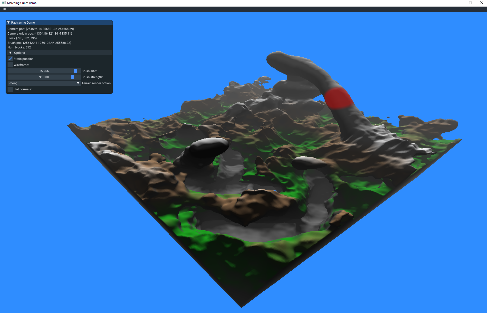

# Marching Cubes Demo

This demo uses the marching cubes algorithm to generate a simple terrain which the user then can use a sculpting tool to modify. It's intended both as an experimentation to learn about marching cubes and also to show my [Utopian Engine](https://github.com/simplerr/UtopianEngine) rendering framework used in a small application. It is written in C++ and Vulkan is used as the rendering API.

## Building

1) `git submodule update --init --recursive`
2) `./generate_workspace` to generate a VS 2019 solution
3) Open "Marching Cubes Demo.sln" and build

Currently the only supported platform is Windows. If you wish to generate another solution than VS 2019 you can run
premake manually, e.g `UtopianEngine\tools\premake5.exe --file=premake.lua vs2017`.

## Method
In the current state of the demo the size of the world is fixed at a size of 8x8x8 blocks which in turn each contains 32x32x32 voxels.

At initialization a 256x256x256 3D texture is generated containing FBM noise. At runtime the marching cubes compute shader is then invoked for each visible block and this 3D noise texture is then sampled from in order to retrieve the density values. The marching cubes compute shader outputs the resulting mesh to a SSBO which at a later stage acts as an vertex buffer when rendering the terrain.

In order to support sculpting of the terrain the 3D noise texture that was generated at init is modified by adding/subracting density values from it at the brush tool position using a compute shader. Each time the 3D texture is modified surrounding blocks needs to be regenerated again in order for the terrain to be updated. The entire 256x256x256 of the 3D texture is not dispatch but rather a subset of it to optimize performance.

To calculate where on the terrain the sculpting should be applied the terrain rendering fragment shader outputs the world space positions to an extra attachment image. This position image is then read from in a compute shader which takes the cursors coordinate in pixels as input and outputs the world space position of that pixel to a SSBO. This position is then converted to texture coordinates and sent to the brush shader.

## References
http://paulbourke.net/geometry/polygonise/  
http://http.developer.nvidia.com/GPUGems3/gpugems3_ch01.html  
http://www.icare3d.org/codes-and-projects/codes/opengl_geometry_shader_marching_cubes.html  
https://0fps.net/2012/07/12/smooth-voxel-terrain-part-2/
